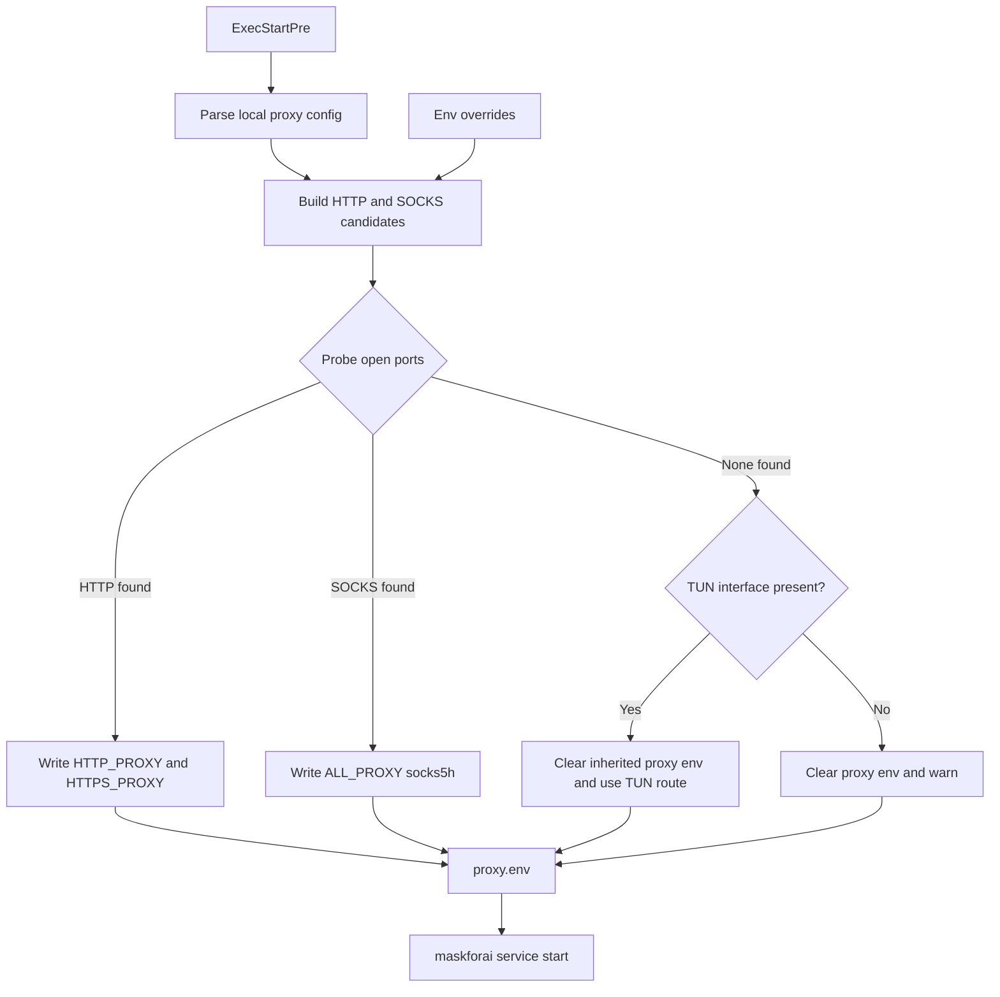

# MaskForAI

Local HTTP proxy that masks sensitive data (API keys, passwords, PII) in Claude Code / OpenAI-compatible requests before forwarding to provider upstreams or relays.

## Install

**Supported:** Ubuntu, Debian, Fedora, Rocky Linux

```bash
# From the maskforai directory
./install.sh

# Or with options
./install.sh --install-dir /path/to/maskforai [--no-start] [--no-systemd] [--no-adaptive-proxy] [--auto-strip-proxy-env]
```

The installer will:
1. Detect distro and install build dependencies (gcc, curl) if needed
2. Install Rust via rustup if `cargo` is not present
3. Build from source and install to `${XDG_BIN_HOME:-~/.local/bin}/maskforai`
4. Create `${XDG_CONFIG_HOME:-~/.config}/maskforai/env.conf`, `providers.toml`, and systemd user service
5. Enable and start the service

**Post-install:** Edit `~/.config/maskforai/providers.toml` and set each provider `upstream_url`.

## Adaptive proxy detection

On Linux installs that use systemd, `install.sh` now installs a drop-in that generates
`$XDG_RUNTIME_DIR/maskforai/proxy.env` immediately before `maskforai` starts. The installer
also writes the service unit and drop-in with the resolved `${XDG_BIN_HOME:-~/.local/bin}`
and `${XDG_CONFIG_HOME:-~/.config}` paths, so custom XDG layouts work without manual edits.

Detection order:

1. Explicit overrides from `MASKFORAI_PROXY_PROBE_PORTS`
2. Parsed local core config (`v2rayN`, `sing-box`, `xray`, `v2ray`, `clash`, `mihomo`)
3. Fallback port probes
4. TUN interface detection
5. Direct egress with a warning

When an HTTP proxy is found, the drop-in writes `HTTP_PROXY` / `HTTPS_PROXY`.
When a SOCKS proxy is found, it writes `ALL_PROXY=socks5h://...`.
When only TUN is present, it clears inherited proxy variables so `reqwest` uses the system route instead of stale loopback proxy settings.

### Override variables

| Variable | Default | Description |
|---------|---------|-------------|
| `MASKFORAI_PROXY_HOST` | `127.0.0.1` | Loopback host used for probe candidates when config omits bind address |
| `MASKFORAI_PROXY_PROBE_PORTS` | unset | Comma-separated priority list, e.g. `10809:http,10808:socks5,7890:http` |
| `MASKFORAI_PROXY_HTTP_PORTS` | `10809 7890 2081` | Conservative fallback HTTP probe list for common V2Ray/Clash-style setups |
| `MASKFORAI_PROXY_SOCKS_PORTS` | `10808 1080 1081 7891 2080` | Fallback SOCKS probe list |
| `MASKFORAI_TUN_IFACES` | `singbox_tun tun0 utun0 wg0` | Preferred TUN interface names before wildcard fallback |

### Troubleshooting

```bash
# Inspect the generated environment
"${XDG_BIN_HOME:-$HOME/.local/bin}/maskforai-detect-proxy.sh" /tmp/maskforai-proxy.env && sed -n '1,120p' /tmp/maskforai-proxy.env

# Check the mode chosen at service start
journalctl --user -u maskforai -n 20 --no-pager | rg maskforai-detect-proxy

# Disable adaptive proxy installation if you manage proxy variables manually
./install.sh --no-adaptive-proxy
```



## Architecture

```
[Claude client] --HTTP--> [MaskForAI :8432] --HTTPS--> [Claude relay/upstream]
[OpenAI client] --HTTP--> [MaskForAI :8434] --HTTPS--> [OpenAI relay/upstream]
```

One `maskforai` process can expose multiple local ports, one per provider. Each listener has its own upstream URL and provider behavior profile.

## Provider config

Provider listeners live in `~/.config/maskforai/providers.toml`:

```toml
[providers.claude]
type = "claude"
bind = "127.0.0.1"
port = 8432
upstream_url = "https://api.anthropic.com"

[providers.openai]
type = "openai"
bind = "127.0.0.1"
port = 8434
upstream_url = "https://api.openai.com"
```

Supported provider types today:
- `claude`
- `openai`

If `providers.toml` is missing, MaskForAI falls back to legacy single-provider mode using `MASKFORAI_PORT`, `MASKFORAI_BIND`, and `MASKFORAI_UPSTREAM`.

## Usage with Claude Code

Point Claude Code to the proxy:

```bash
export ANTHROPIC_BASE_URL=http://127.0.0.1:8432
export ANTHROPIC_AUTH_TOKEN=<your-token>
```

## Usage with OpenAI-compatible clients

Point the client to the OpenAI listener:

```bash
export OPENAI_BASE_URL=http://127.0.0.1:8434
export OPENAI_API_KEY=<your-token>
```

Example provider config for Codex:

```toml
[model_providers.maskforai_openai]
name = "maskforai_openai"
base_url = "http://127.0.0.1:8434"
wire_api = "responses"
requires_openai_auth = true
env_key = "OPENAI_API_KEY"
```

## Build

```bash
cd maskforai
cargo build --release
```

## Windows

There is no `install.sh`; use `cargo build --release` and run `target\release\maskforai.exe`.

- **Config directory:** `%USERPROFILE%\.config\maskforai\` for `providers.toml` and `patterns.toml` when `XDG_CONFIG_HOME` is not set (otherwise `XDG_CONFIG_HOME\maskforai\` as on Linux). You can still point to specific files with `MASKFORAI_PROVIDERS_FILE`, `MASKFORAI_PATTERNS_FILE`, and `MASKFORAI_ENV_FILE`.
- **`env.conf`:** On startup, the process loads optional `KEY=VALUE` lines from `env.conf` in that directory (same idea as the Linux systemd `EnvironmentFile`). Existing environment variables are not overwritten. Use this for `HTTP_PROXY` / `HTTPS_PROXY` / `ALL_PROXY` / `NO_PROXY` when you want explicit manual proxy settings on Windows.
- **Binary path:** add `target\release` to your `PATH` or copy `maskforai.exe` where you prefer.

## Configure global defaults

`env.conf` now holds global masking defaults and legacy single-provider fallback:

```bash
export MASKFORAI_UPSTREAM=https://api.anthropic.com
```

## Run the proxy

```bash
./target/release/maskforai
```

Defaults:
- Claude listener on `127.0.0.1:8432`
- OpenAI listener on `127.0.0.1:8434`
- Web UI on `127.0.0.1:8433`

## Web UI

MaskForAI includes a built-in web interface for configuration management, available at `http://127.0.0.1:8433` by default.

Features:
- View real-time statistics (requests, masks, blocks)
- View configured providers and per-provider counters
- Edit configuration (sensitivity, whistledown, dry-run, etc.)
- Manage custom regex patterns
- Manage allowlist
- Test masking in real-time
- Live log streaming via WebSocket

Set `MASKFORAI_WEB_PORT=0` to disable the web UI.

## Environment variables

| Variable | Default | Description |
|---------|---------|-------------|
| `MASKFORAI_PORT` | 8432 | Legacy single-provider listen port |
| `MASKFORAI_BIND` | 127.0.0.1 | Legacy single-provider bind |
| `MASKFORAI_UPSTREAM` | (from ANTHROPIC_BASE_URL) | Legacy single-provider upstream URL |
| `MASKFORAI_LOG_FILTER` | off | Filter logging: `off`, `summary`, `detailed` |
| `MASKFORAI_SENSITIVITY` | medium | Sensitivity: `low`, `medium`, `high`, `paranoid` |
| `MASKFORAI_WHISTLEDOWN` | true | Reversible masking with numbered tokens |
| `MASKFORAI_DRY_RUN` | false | Log detections but don't modify traffic |
| `MASKFORAI_WEB_PORT` | 8433 | Web UI port (0 = disabled) |
| `MASKFORAI_MIN_SCORE` | 0.0 | Minimum confidence score (0.0–1.0) |
| `MASKFORAI_ALLOWLIST` | | Comma-separated values to never mask |
| `MASKFORAI_AUDIT_LOG` | false | Log SHA256 hashes of masked values |

### Filter logging

When `MASKFORAI_LOG_FILTER` is set, the proxy logs what was masked:

- **off** (default): no filter logging
- **summary** / **1** / **true**: one line per request, e.g. `filter applied path=/v1/messages filters=email=1, api_key=2`
- **detailed** / **2** / **debug**: one debug line per mask type and context

Use `RUST_LOG=maskforai=info` (or `debug` for detailed) to see filter logs.

## Features

- **75+ regex patterns**: API keys (Anthropic, OpenAI, GitHub, AWS, Stripe, etc.), PEM keys, DB connections, JWT/Bearer tokens, PII (email, phone, SSN, credit card, IP, MAC)
- **Sensitivity levels**: Low (secrets only), Medium (+ PII), High (+ context-dependent), Paranoid (+ entropy detection)
- **Whistledown**: Reversible masking — PII replaced with `[[TYPE_N]]` tokens, restored in responses
- **SSE streaming**: Real-time demasking for Server-Sent Events with overlap buffer
- **Encrypted vault**: AES-256-GCM + Argon2id for secure mapping storage
- **Fake generation**: Format-matching fakes (Luhn-valid cards, valid SSN format, etc.)
- **Entropy detection**: Shannon entropy-based high-entropy secret detection
- **Dry-run mode**: Log detections without modifying traffic
- **Web UI**: Built-in dashboard for configuration and monitoring
- **Multi-provider listeners**: One process can serve Claude and OpenAI-compatible traffic on different local ports
- **Custom patterns**: Add your own regex patterns via TOML config

Format: `[masked:type]****` so the AI knows data was redacted.

## TLS / HTTPS

The proxy runs over HTTP by default. For HTTPS:

- Run the proxy behind nginx or Caddy with TLS termination
- Or use a tunnel (e.g. cloudflared) to expose it over HTTPS

## Testing

```bash
cargo test
bash tests/test-detect-proxy.sh
```

`cargo test` covers the Rust proxy itself. `bash tests/test-detect-proxy.sh` covers the adaptive proxy detector script.

## License

MIT
